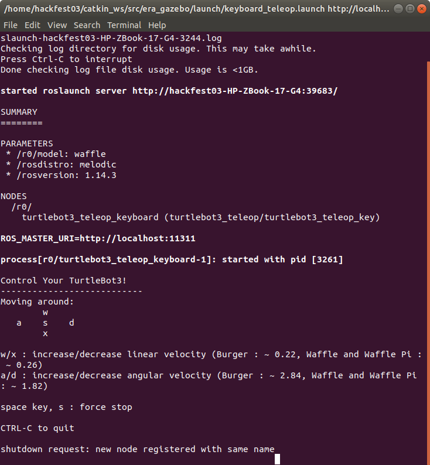

# What does ERA exactly do?
Here we will explain more profoundly, what the main instructions from the [ERA GitHub](https://github.com/IBM/era) exactly do and what are the main components of the software. 

## Basic steps
To explain ERA in general, we can execute the most basic command that prompts all the tools that are involved on the ERA software, but before that, as we know from the previous [ROS Basics](../ROS_Basics) :

> ```
> source /home/*your_username*/catkin_ws/devel/setup.bash
> ```

Because typing this commands on every terminal that we open can become tedious, on the folder [Automatization](../Automatization), you will find bash scripts that execute the former commands and makes the task easy and comfortable. 

Remember! You have to give permissions (sudo chmod +x <name_of_the_file>) to be able to execute it!


## Content
* Basic Interaction
* Bag File
* Move the robot by yourself!
* Troubleshooting

## Basic Interaction

  #### Command
  
> ```
> roslaunch era_gazebo era_melodic.launch
> ```

  #### Terminal Output

Terminal Message


  #### Software


  #### Modules Used
  
  #### What Can We Do?


## Bag File

 #### Command 1
  
> ```
> roslaunch era_gazebo era_playback_melodic.launch bag_name:=/home/hackfest03/catkin_ws/src/era_gazebo/bagfiles/cmd_vel_r0.bag
> ```

#### Command 2
  
> ```
> roslaunch era_gazebo era_playback_melodic.launch bag_name:=/home/hackfest03/catkin_ws/src/era_gazebo/bagfiles/cmd_vel_r0.bag gui:=false
> ```

#### Command 3
  
> ```
> roslaunch era_gazebo era_playback_melodic.launch bag_name:=/home/hackfest03/catkin_ws/src/era_gazebo/bagfiles/cmd_vel_r0.bag gui:=false prof:=true
> ```


 #### Terminal Output

 #### Software
 

 


 #### Modules Used
  
 #### What Can We Do?

## Move the robot by yourself!

 #### Command

Open a new terminal for each one of the robots and type: 
> ```
> cd /home/hackfest03/catkin_ws/
> source devel/setup.bash
> roslaunch era_gazebo keyboard_teleop.launch namespace:=<name_of_the_robot>
> ```

In our case, the names of the robots are r0 & r1. The instructions are simple, in order to move the robots, you will need the w a s d x buttons of your keyboard. The difference between usual controllers is that pressing w to move forward increases the speed towards that direction and if we stop pressing it, the movement becomes uniform but that does not mean that the robot will stop until we press the same amount of time on the opposite direction (x). 

 #### Terminal Output
 
Robot starting interface:


Robot during movement:


 #### Software
 
Robot Movement:


 #### Modules Used
 
 On the environment in general, they are exactly the same ones as commented before on the case without the bag, but on each one of the robots, we generate the node turtlebot3_teleop_keyboard (turtlebot3_teleop/turtlebot3_teleop_key).
 
Also, observing the terminal output, you can see as a preconfiguration, that it starts an automatic master. What does this mean? That if you alter the configuration, you can control both robots from different computers if they use the same software. As a default, the IP & port default are http://localhost:11311 but we can modify it following the instructions on the [ERA Wiki for 2 computers](https://github.com/IBM/era/wiki/ERA-in-two-computers).

 #### What Can We Do?


## Troubleshooting
After trying to execute the bag file, I had problems because the software was asking for two expected inputs:

In the end, the solution was going to  and modify the era_playback_melodic.launch, where we comment the following two lines of code by adding an ! after the < symbol:
> ```
> <-- arg name="prof" value="$(arg prof)" -->
> <-- arg name="prof_output_filename" value="$(arg prof_output_filename)" -->
> ```
The reason this may have happened, after doing some research about it, it may be due to the change of versions of ROS between Kinectic and Melodic.

